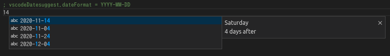
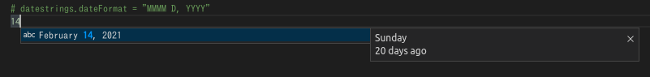

# Autocomplete datestrings

  

Autocomplete date strings on VS Code

## License

MIT

- This extension based on [vscode-extension-sample/lsp-sample](https://github.com/microsoft/vscode-extension-samples/tree/master/lsp-sample).
- The icon was taken from [ICOON MONO](https://icooon-mono.com/12572-%E3%82%AB%E3%83%AC%E3%83%B3%E3%83%80%E3%83%BC%E3%81%AE%E3%83%95%E3%83%AA%E3%83%BC%E3%82%A2%E3%82%A4%E3%82%B3%E3%83%B325/).
