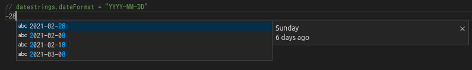

datestrings
=====

[](https://github.com/oshikiri/vscode-datestrings/actions?query=workflow%3Atest) [](https://github.com/oshikiri/vscode-datestrings/actions?query=workflow%3Apublish)





## Packaging
```shell
npm run package
```

## License

MIT

This extension based on [vscode-extension-sample/lsp-sample](https://github.com/microsoft/vscode-extension-samples/tree/master/lsp-sample).
